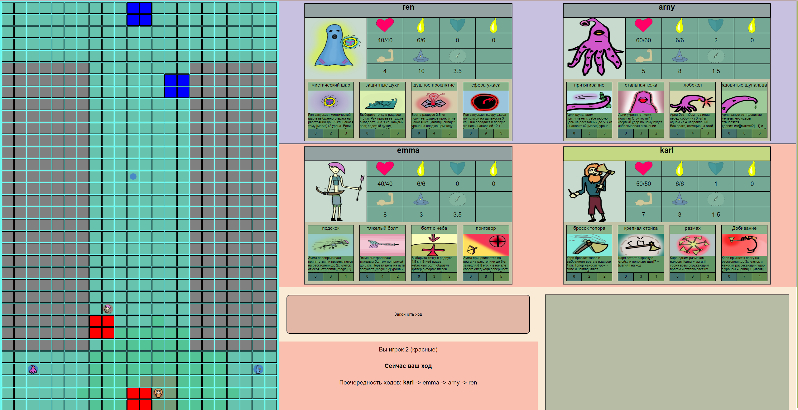
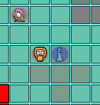
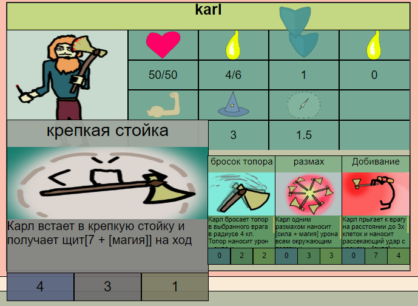
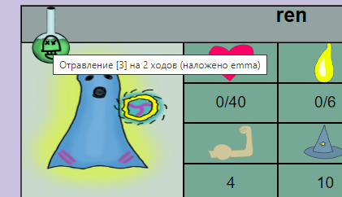

# Board MOBA

This is my turn-based MOBA game. In my childhood, I developed this game as a board game. Now, I've decided to create a browser game inspired by it.

## Technology Stack

The project is developed using Python 3.10, Django, JS, HTML, and CSS. The game's engine is written in pure JS, and the data exchange system and server interaction are implemented in Django.

## Design

I hand-drew the entire UI, so it might look unprofessional, but it's filled with soul.

### Main Game Page

Here's what the main game page looks like:

## Game Modes

The standard game mode involves a 2v2 battle between characters; blue team versus red team. There are 2 players in total, each controlling 2 characters, chosen at the start of the game.

## Characters and Skills

Every character has 4 unique skills, and by combining them, players can devise various strategies.

## Game Objective

The objective of the game is to destroy 2 of the opponent's towers.

## Character Leveling

Characters can level up throughout the game, and each character is designed to be upgraded in different ways, depending on the player's strategy.

Characters can use their skills to not only deal direct damage to enemies but also apply effects to them.

## Conclusion

You might say that this game is like 4D chess... Or it will become so once I balance it.

I started developing the game a while ago, originally creating the interface in russian. Now I'm translating the game into English and Ukrainian.

